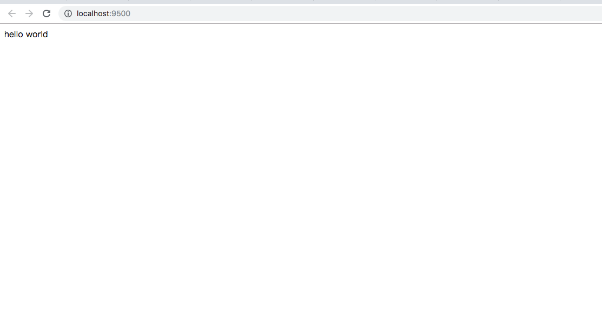

# single-spa

## 启动项目
使用 concurrently 模块实现一键安装
```bash
# 安装所有项目的依赖
$ npm run install-all
# 启动所有模块
$ npm run start-all
```
OR

```bash
# index.html
$ npm i 
$ npm start

# navbar project vue
$ cd navbar
$ npm i && npm serve 

# cra project react
$ cd cra
$ npm i && npm start

```

打开浏览器 `http://localhost:9500/`

## 开发日志

### 创建 single-spa 基座架构 hello-world

创建 index.html 、 下载依赖

```bash
# 创建 index.html
$ touch index.html
# 创建package.json用于存储相关依赖
$ npm init -y
# 安装相关依赖
$ npm i single-spa systemjs import-map-overrides --save

```

index.html

```html
<!DOCTYPE html>
<html lang="en">
    <head>
        <meta charset="UTF-8" />
        <meta name="viewport" content="width=device-width, initial-scale=1.0" />
        <meta http-equiv="X-UA-Compatible" content="ie=edge" />
        <title>single-spa-demo</title>
    </head>
    <body>
        hello world
    </body>
</html>
```

下载 serve 模块

```bash
# 用于启动一个本地服务
$ npm i serve --save-dev

```

修改 package.json scripts

```json
  "scripts": {
    "start": "serve -s -l 9500"
  },
```

启动服务

```bash
npm start
```

serve 服务启动成功


### 引入 systemjs

head

```html
<head>
    <meta charset="UTF-8" />
    <meta name="viewport" content="width=device-width, initial-scale=1.0" />
    <meta http-equiv="X-UA-Compatible" content="ie=edge" />
    <title>single-spa-demo</title>
    <meta name="importmap-type" content="systemjs-importmap" />
    <script type="systemjs-importmap">
        {
            "imports": {
                "single-spa": "http://localhost:9500/node_modules/single-spa/lib/system/single-spa.min.js"
            }
        }
    </script>

    <script src="http://localhost:9500/node_modules/import-map-overrides/dist/import-map-overrides.js"></script>
    <script src="http://localhost:9500/node_modules/systemjs/dist/system.min.js"></script>
    <script src="http://localhost:9500/node_modules/systemjs/dist/extras/amd.min.js"></script>
    <script src="http://localhost:9500/node_modules/systemjs/dist/extras/named-exports.min.js"></script>
    <script src="http://localhost:9500/node_modules/systemjs/dist/extras/named-register.min.js"></script>
    <script src="http://localhost:9500/node_modules/systemjs/dist/extras/use-default.min.js"></script>
</head>
```

body

```html
<body>
    <script>
        (function() {
            Promise.all([System.import('single-spa')]).then(function(modules) {
                const singleSpa = modules[0];

                // singleSpa.registerApplication(
                //     'navbar',
                //     () => System.import('navbar'),
                //     location => true
                // );

                singleSpa.start();
            });
        })();
    </script>
    <!-- See https://github.com/joeldenning/import-map-overrides#user-interface  -->
    <import-map-overrides-full
        show-when-local-storage="overrides-ui"
    ></import-map-overrides-full>
</body>
```
### navbar cra project

- [vue navbar](./navbar/README.md)

- [react cra](./cra/README.md)
