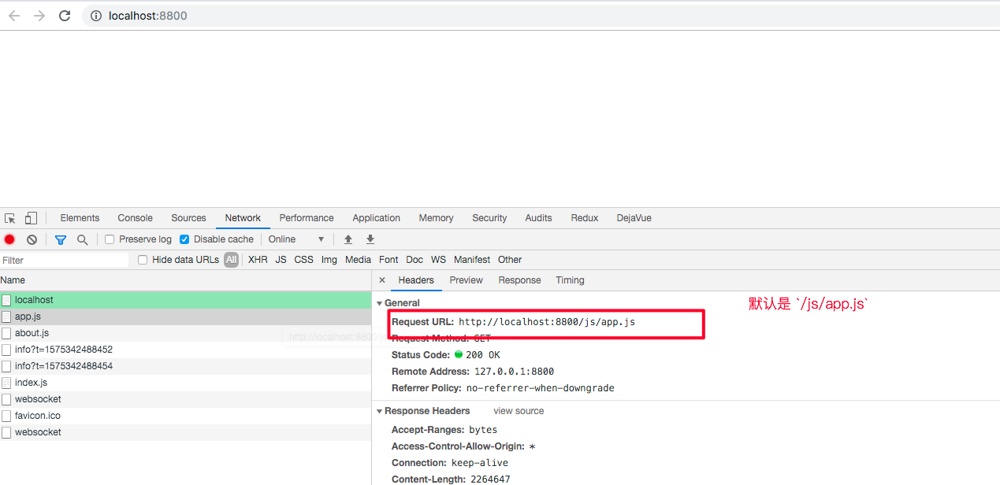
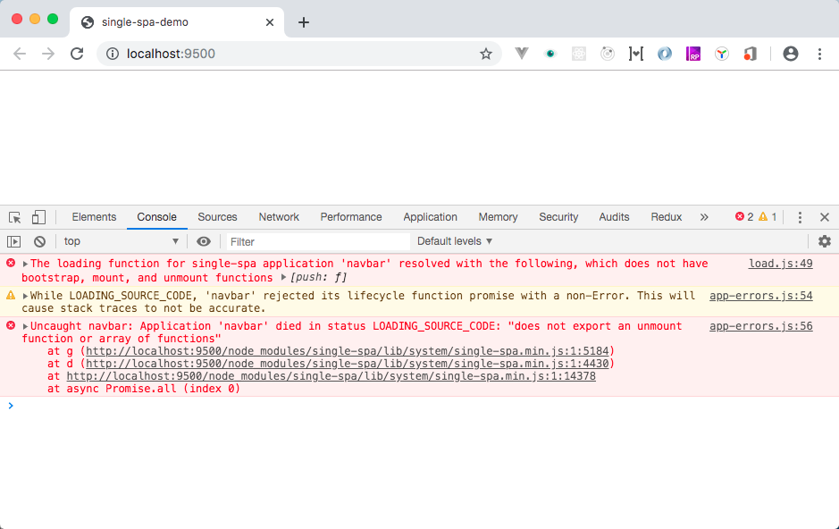
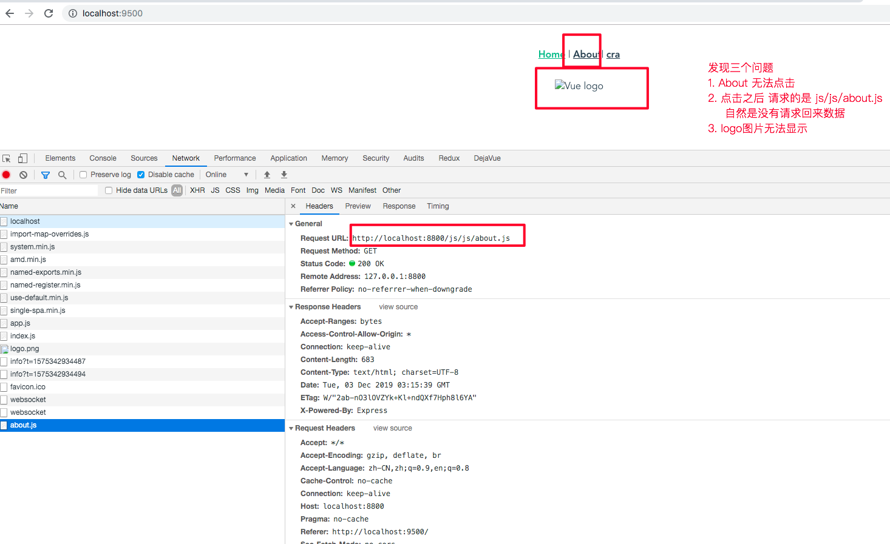
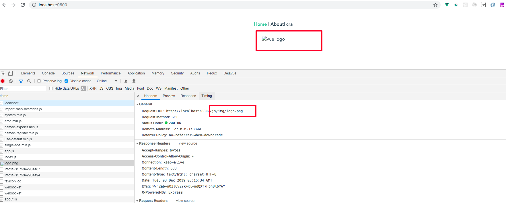
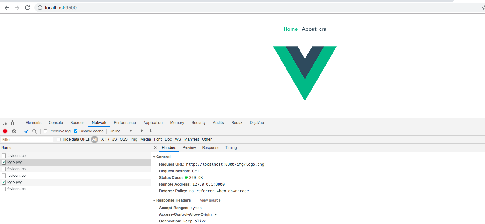

# navbar

## Project setup

```bash
$ npm install
# Compiles and hot-reloads for development
$ npm run serve OR npm start
# Compiles and minifies for production
$ npm run build
# Lints and fixes files
$ npm run lint
```

### Customize configuration

See [Configuration Reference](https://cli.vuejs.org/config/).

### 开发日志

vue project

```bash
# install cli 这里安装的是最新版本 vue-cli4.xx
# vue-cli3.xx 与 vue-cli4.xx版本有区别
# vue-cli3.xx版本开发环境`output.filename`是 项目根目录 也就是index.html所在的目录
# 而vue-cli4.xx版本是相对于app.js的引入目录 这里需要额外的注意
$ npm install -g @vue/cli
# create navbar
$ vue create navbar

$ touch vue.config.js
```

`navbar/vue.config.js`

```js
module.exports = {
    devServer: {
        headers: {
            'Access-Control-Allow-Origin': '*'
        },
        open: false,
        port: '8800'
    },
    filenameHashing: false
};
```

`navbar/src/router/js` mode: 'history'

```js
// ...
const router = new VueRouter({
    +++mode: 'history',
    routes
});

export default router;
```

`navbar/src/views/Home.vue`

```html
<template>
    <div class="home">
        
    </div>
</template>

<script>
    // @ is an alias to /src
    // import HelloWorld from '@/components/HelloWorld.vue';

    export default {
        name: 'home',
        components: {}
    };
</script>
```

`navbar/src/App.vue`

```html
<template>
    <div id="app">
        <div id="nav">
            <router-link to="/">Home</router-link> |
            <router-link to="/about">About</router-link>| ++++++
            <router-link to="/cra">cra</router-link>
        </div>
        <router-view />
    </div>
</template>
```

安装依赖

```bash
$ npm i --save systemjs-webpack-interop single-spa-vue
```

引入 systemjs-webpack-interop

```bash
# 创建一个set-public-path文件
$ touch src/set-public-path.js
```

src/set-public-path.js

```js
import {setPublicPath} from 'systemjs-webpack-interop';

setPublicPath('navbar');
```

在 `src/main.js` 最顶部中引入 `src/set-public-path.js`

```js
import './set-public-path';
import Vue from 'vue';
import App from '@/App.vue';
// ...
```

在`navbar/src/main.js`引入`single-spa-vue`

```js
import './set-public-path';
import Vue from 'vue';
import App from './App.vue';
import router from './router';
import store from './store';
import singleSpaVue from 'single-spa-vue';
Vue.config.productionTip = false;

// new Vue({
//   router,
//   store,
//   render: h => h(App)
// }).$mount('#app')

const vueLifecycles = singleSpaVue({
    Vue,
    appOptions: {
        router,
        store,
        render: h => h(App)
    }
});

export const bootstrap = vueLifecycles.bootstrap;
export const mount = vueLifecycles.mount;
export const unmount = vueLifecycles.unmount;
```

### 入口文件 index.html 用引入 app.js

打开浏览器 `F12` 查看 app.j 的文件路径


故：下面的 navbar URL 为`http://localhost:8800/js/app.js`

index.html head

```html
<script type="systemjs-importmap">
    {
        "imports": {
            "navbar": "http://localhost:8800/js/app.js",
            "single-spa": "http://localhost:9500/node_modules/single-spa/lib/system/single-spa.min.js"
        }
    }
</script>
```

index.html body script
引入 imports 中定义的 navbar 模块

```html
<script>
    (function() {
        Promise.all([System.import('single-spa')]).then(function(modules) {
            const singleSpa = modules[0];

            singleSpa.registerApplication(
                'navbar',
                () => System.import('navbar'),
                location => true
            );

            singleSpa.start();
        });
    })();
</script>
```

Open in Chrome Browser `http://localhost:9500/` Error message on the console

```log
The loading function for single-spa application 'navbar' resolved with the following, which does not have bootstrap, mount, and unmount functions
app-errors.js:54 While LOADING_SOURCE_CODE, 'navbar' rejected its lifecycle function promise with a non-Error. This will cause stack traces to not be accurate.
g @ app-errors.js:54
d @ app-errors.js:4
app-errors.js:56 Uncaught navbar: Application 'navbar' died in status LOADING_SOURCE_CODE: "does not export an unmount function or array of functions"
```



跟 官方推荐的 demo [coexisting-vue-microfrontends](https://github.com/joeldenning/coexisting-vue-microfrontends)
一一对比，
发现，它的 package.json 中多了一个模块 `vue-cli-plugin-single-spa`

在 navbar 项目下 运行一下命令

```bash
$ npm i --save-dev vue-cli-plugin-single-spa

# 重启项目
$ Command + C && npm run serve
```

再次打开浏览器`http://localhost:9500/`
发现虽然成功引入了 navbar 项目
但是发现了三个问题：

-   1. About 点击之后没有达到预期效果 跳转到 about 页面
-   2. 点击 About 请求的 URL 地址不对 应该是 `/js/about.js` 但现在是 `/js/about.js`
       显然是 取了 app.js 的路径
-   3. logo 图片无法显示，查看 network 之后还是路径不正确的问题





解决方法：修改 `/navbar/vue.config.js` 配置文件 output.js 的默认输出

```js
// /navbar/vue.config.js
module.exports = {
    publicPath: '/',
    configureWebpack: config => {
        // https://cli.vuejs.org/zh/guide/webpack.html#%E7%AE%80%E5%8D%95%E7%9A%84%E9%85%8D%E7%BD%AE%E6%96%B9%E5%BC%8F
        if (process.env.NODE_ENV === 'production') {
            // 为生产环境修改配置...
            //   // 压缩后的文件 添加.min.js后缀
            //   config.output.filename = 'assets/js/[name].[contenthash:8].min.js'
            //   config.output.chunkFilename =
            //       'assets/js/[name].[contenthash:8].min.js'
        } else {
            // 为开发环境修改配置...

            // 解决 所有的文件都是基于 app.js 的路径的bug
            config.output.filename = '[name].js';
            config.output.chunkFilename = '[name].js';
            config.devtool = 'cheap-module-eval-source-map';
        }
    },
    devServer: {
        headers: {
            'Access-Control-Allow-Origin': '*'
        },
        open: false,
        port: '8800'
    },
    filenameHashing: false
};
```

此时需要修改入口文件 app.js 不再是 `/js/app.js` 而是 `/app.js`

index.html head

```html
<script type="systemjs-importmap">
    {
        "imports": {
            "navbar": "http://localhost:8800/app.js",
            "single-spa": "http://localhost:9500/node_modules/single-spa/lib/system/single-spa.min.js"
        }
    }
</script>
```

重启项目 navbar

```bash
# 重启项目
$ Command + C && npm run serve
```

再次打开浏览器`http://localhost:9500/`
成功引入 navbar 项目



